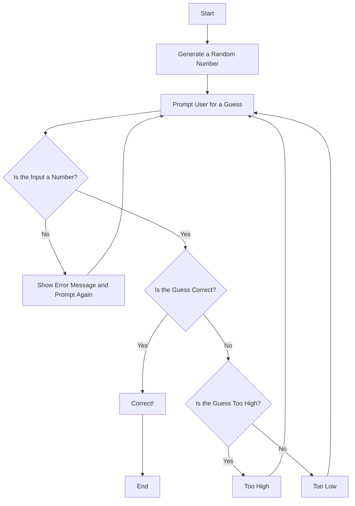

## 🧾 Description of the Flowchart Steps

1. **Start**  
   The game begins.

2. **Generate a Random Number**  
   The program generates a random number within a specified range (e.g., 1 to 100). The person will therefore try and guess that number.

3. **Prompt User for a Guess**  
   The person is asked to enter their guess.

4. **Is the Input a Number?**  
   - If the input is **not** a number, an error message is displayed, and they have to try again. 
   - If the input **is** a number, the program checks if it matches the random number.

5. **Is the Guess Correct?**  
   - If the guess **is correct**, a success message (Correct!) is shown, and the game ends.
   - If the guess **is incorrect**, the program checks whether the guess is too high or too low.

6. **Is the Guess Too High?**  
   - If the guess is **too high**, it tells the person and they are prompted to guess again.
   - If the guess is **too low**, it tells the person and they are prompted to guess again.

7. **Repeat**  
   Steps 3 to 6 are repeated until the user enters the correct number.

8. **End**  
   The game ends because the person guessed the number.
